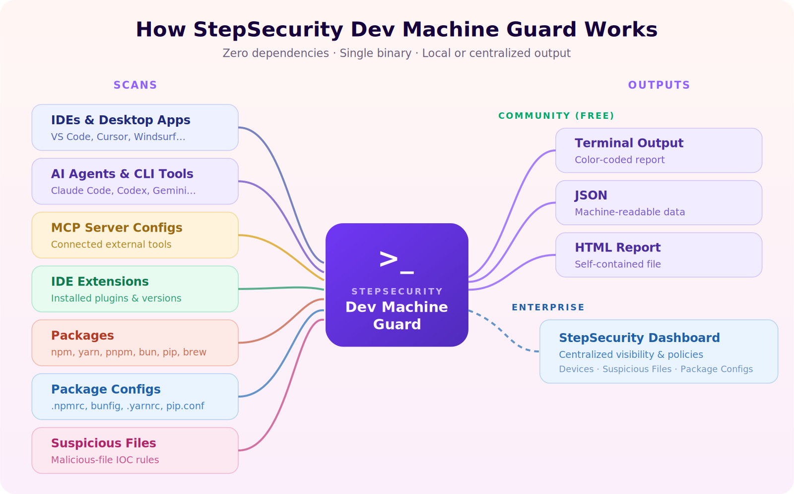

<h1 align="center">StepSecurity Dev Machine Guard</h1>

<p align="center">
  
</p>

<p align="center">
  
</p>

<p align="center">
  <a href="https://github.com/step-security/dev-machine-guard/actions/workflows/tests.yml"></a>
  <a href="https://github.com/step-security/dev-machine-guard/actions/workflows/release.yml"></a>
  <a href="https://goreportcard.com/report/github.com/step-security/dev-machine-guard"></a>
  <a href="https://pkg.go.dev/github.com/step-security/dev-machine-guard"></a>
  <a href="LICENSE"></a>
  <a href="https://github.com/step-security/dev-machine-guard/releases"></a>
</p>

<p align="center">
  <b>Scan your dev machine for AI agents, MCP servers, IDE extensions, and suspicious packages — in seconds.</b>
</p>

## Why Dev Machine Guard?

Developer machines are the new attack surface. They hold high-value assets — GitHub tokens, cloud credentials, SSH keys — and routinely execute untrusted code through dependencies and AI-powered tools. Recent supply chain attacks have shown that malicious VS Code extensions can steal credentials, rogue MCP servers can access your codebase, and compromised npm packages can exfiltrate secrets.

<p align="center">
  
</p>

**EDR and traditional MDM solutions** monitor device posture and compliance, but they have **zero visibility** into the developer tooling layer:

| Capability                  | EDR / MDM | Dev Machine Guard |
| --------------------------- | :-------: | :---------------: |
| IDE extension audit         |           |        Yes        |
| AI agent & tool inventory   |           |        Yes        |
| MCP server config audit     |           |        Yes        |
| Package scanning (Node.js, Homebrew, Python, system) |  |  Yes  |
| Cross-platform (macOS, Windows, Linux) | Yes | Yes        |
| Device posture & compliance |    Yes    |                   |
| Malware / virus detection   |    Yes    |                   |

**Dev Machine Guard is complementary to EDR/MDM — not a replacement.** Deploy it alongside your existing tools via MDM (Jamf, Kandji, Intune) or run it standalone.

<p align="center">
  
</p>

## Quick Start

### Install from release (recommended)

Download the latest binary for your platform from [GitHub Releases](https://github.com/step-security/dev-machine-guard/releases):

**macOS:**

```bash
# Apple Silicon (M1/M2/M3/M4)
curl -sSL https://github.com/step-security/dev-machine-guard/releases/latest/download/stepsecurity-dev-machine-guard_darwin_arm64 -o stepsecurity-dev-machine-guard
chmod +x stepsecurity-dev-machine-guard

# Intel Mac
curl -sSL https://github.com/step-security/dev-machine-guard/releases/latest/download/stepsecurity-dev-machine-guard_darwin_amd64 -o stepsecurity-dev-machine-guard
chmod +x stepsecurity-dev-machine-guard

# Run the scan
./stepsecurity-dev-machine-guard
```

**Windows:**

```powershell
# x64
Invoke-WebRequest -Uri "https://github.com/step-security/dev-machine-guard/releases/latest/download/stepsecurity-dev-machine-guard_windows_amd64.exe" -OutFile "stepsecurity-dev-machine-guard.exe"

# ARM64
Invoke-WebRequest -Uri "https://github.com/step-security/dev-machine-guard/releases/latest/download/stepsecurity-dev-machine-guard_windows_arm64.exe" -OutFile "stepsecurity-dev-machine-guard.exe"

# Run the scan
.\stepsecurity-dev-machine-guard.exe
```

**Linux:**

```bash
# x64
curl -sSL https://github.com/step-security/dev-machine-guard/releases/latest/download/stepsecurity-dev-machine-guard_linux_amd64 -o stepsecurity-dev-machine-guard
chmod +x stepsecurity-dev-machine-guard

# ARM64
curl -sSL https://github.com/step-security/dev-machine-guard/releases/latest/download/stepsecurity-dev-machine-guard_linux_arm64 -o stepsecurity-dev-machine-guard
chmod +x stepsecurity-dev-machine-guard

# Run the scan
./stepsecurity-dev-machine-guard
```

Pre-built `.deb` and `.rpm` packages are also available on the [releases page](https://github.com/step-security/dev-machine-guard/releases).

### Build from source

```bash
git clone https://github.com/step-security/dev-machine-guard.git
cd dev-machine-guard
make build
./stepsecurity-dev-machine-guard
```

Requires Go 1.24+. The binary has zero external dependencies.

## Usage

```
stepsecurity-dev-machine-guard [COMMAND] [OPTIONS]
```

### Commands

| Command          | Description                                                     |
| ---------------- | --------------------------------------------------------------- |
| _(none)_         | Run a scan (community mode, pretty output)                      |
| `configure`      | Interactively set all settings (enterprise, scan, output)       |
| `configure show` | Show current configuration (API key masked)                     |
| `install`        | Install scheduled scanning — launchd (macOS), systemd (Linux), schtasks (Windows) |
| `uninstall`      | Remove scheduled scanning configuration                                           |
| `send-telemetry` | Upload scan results to the StepSecurity dashboard (enterprise)  |

### Output Formats

| Flag          | Description                              |
| ------------- | ---------------------------------------- |
| `--pretty`    | Pretty terminal output (default)         |
| `--json`      | JSON output to stdout                    |
| `--html FILE` | Self-contained HTML report saved to FILE |

### Options

| Flag                         | Description                                                   |
| ---------------------------- | ------------------------------------------------------------- |
| `--search-dirs DIR [DIR...]` | Search DIRs instead of `$HOME` (replaces default; repeatable) |
| `--enable-npm-scan`          | Enable Node.js package scanning                               |
| `--disable-npm-scan`         | Disable Node.js package scanning                              |
| `--enable-brew-scan`         | Enable Homebrew package scanning                              |
| `--disable-brew-scan`        | Disable Homebrew package scanning                             |
| `--enable-python-scan`       | Enable Python package scanning                                |
| `--disable-python-scan`      | Disable Python package scanning                               |
| `--include-bundled-plugins`  | Include bundled/platform IDE plugins in output                |
| `--log-level=LEVEL`          | Log level: `error` \| `warn` \| `info` \| `debug`             |
| `--verbose`                  | Shortcut for `--log-level=debug`                              |
| `--color=WHEN`               | Color mode: `auto` \| `always` \| `never` (default: `auto`)   |
| `-v`, `--version`            | Show version                                                  |
| `-h`, `--help`               | Show help                                                     |

### Examples

```bash
# Pretty terminal output (default)
./stepsecurity-dev-machine-guard

# JSON output
./stepsecurity-dev-machine-guard --json
./stepsecurity-dev-machine-guard --json | python3 -m json.tool   # formatted
./stepsecurity-dev-machine-guard --json > scan.json               # to file

# HTML report
./stepsecurity-dev-machine-guard --html report.html

# Verbose scan with npm packages — shows progress spinners and timing
./stepsecurity-dev-machine-guard --verbose --enable-npm-scan

# Scan specific directories instead of $HOME
./stepsecurity-dev-machine-guard --search-dirs /Volumes/code
./stepsecurity-dev-machine-guard --search-dirs /tmp /opt          # multiple dirs

# Pipe JSON through jq to extract just AI tools
./stepsecurity-dev-machine-guard --json | jq '.ai_agents_and_tools'

# Count IDE extensions
./stepsecurity-dev-machine-guard --json | jq '.summary.ide_extensions_count'

# Check for MCP configs (exit 1 if any found — useful in CI)
count=$(./stepsecurity-dev-machine-guard --json | jq '.summary.mcp_configs_count')
[ "$count" -gt 0 ] && echo "MCP servers detected!" && exit 1

# Disable colors for piping or logging
./stepsecurity-dev-machine-guard --color=never 2>&1 | tee scan.log

# Enterprise: configure all settings interactively
./stepsecurity-dev-machine-guard configure

# Enterprise: view saved configuration (API key masked)
./stepsecurity-dev-machine-guard configure show

# Enterprise: install scheduled scanning (launchd / systemd / schtasks)
./stepsecurity-dev-machine-guard install

# Enterprise: one-time telemetry upload
./stepsecurity-dev-machine-guard send-telemetry

# Enterprise: remove scheduled scanning
./stepsecurity-dev-machine-guard uninstall
```

## Configuration

Run `configure` to set up enterprise credentials and default search directories:

```bash
./stepsecurity-dev-machine-guard configure
```

This interactively prompts for all configurable settings:

| Setting            | Description                                 | Default         |
| ------------------ | ------------------------------------------- | --------------- |
| Customer ID        | Your StepSecurity customer identifier       | _(not set)_     |
| API Endpoint       | StepSecurity backend URL                    | _(not set)_     |
| API Key            | Authentication key for telemetry uploads    | _(not set)_     |
| Scan Frequency     | How often scheduled scans run (hours)       | _(not set)_     |
| Search Directories | Comma-separated list of directories to scan | `$HOME`         |
| Enable NPM Scan    | Node.js package scanning                    | `auto`          |
| Enable Brew Scan   | Homebrew package scanning                   | `auto`          |
| Enable Python Scan | Python package scanning                     | `auto`          |
| Color Mode         | Terminal color output                       | `auto`          |
| Output Format      | Default output format                       | `pretty`        |
| HTML Output File   | Default path for HTML reports               | _(not set)_     |
| Log Level          | Logging verbosity                           | `error`         |

View current settings:

```bash
./stepsecurity-dev-machine-guard configure show
```

```
Configuration (~/.stepsecurity/config.json):

  Customer ID:             my-company
  API Endpoint:            https://api.stepsecurity.io
  API Key:                 ***a1b2
  Scan Frequency:          4 hours
  Search Directories:      $HOME, /Volumes/code
  Enable NPM Scan:         auto
  Enable Brew Scan:        auto
  Enable Python Scan:      auto
  Color Mode:              auto
  Output Format:           pretty
  Log Level:               error
```

Configuration is saved to `~/.stepsecurity/config.json` with `0600` permissions (owner read/write only).

**CLI flags always override config file values** — this matches the shell script behavior. For example, if your config has `output_format: json`, running `./stepsecurity-dev-machine-guard --pretty` uses pretty output. To clear a value during configuration, enter a single dash (`-`).

### Logging and Verbose Mode

By default in community mode, progress messages (spinners, step details) are **suppressed** — you only see the final output. This keeps stdout clean for piping.

```bash
# Default: quiet — clean output, no progress spinners
./stepsecurity-dev-machine-guard --json > scan.json

# Verbose: show progress spinners and step timing
./stepsecurity-dev-machine-guard --verbose

# Fine-grained control: set log level
./stepsecurity-dev-machine-guard --log-level=info

# Save log level in config so it persists across runs
./stepsecurity-dev-machine-guard configure
```

In enterprise mode (`send-telemetry`, `install`), progress is **always shown** regardless of the log level — the output is captured as execution logs and sent to the backend for debugging.

## What It Detects

See [SCAN_COVERAGE.md](SCAN_COVERAGE.md) for the full catalog of supported detections.

| Category             | Examples                                                                                 |
| -------------------- | ---------------------------------------------------------------------------------------- |
| IDEs & Desktop Apps  | VS Code, Cursor, Windsurf, Antigravity, Zed, Claude, Copilot, JetBrains suite (13 IDEs), Eclipse, Android Studio |
| AI CLI Tools         | Claude Code, Codex, Gemini CLI, Kiro, GitHub Copilot CLI, Aider, OpenCode, Cursor Agent  |
| AI Agents            | Claude Cowork, OpenClaw, ClawdBot, GPT-Engineer                                          |
| AI Frameworks        | Ollama, LM Studio, LocalAI, Text Generation WebUI                                        |
| MCP Server Configs   | Claude Desktop, Claude Code, Cursor, Windsurf, Antigravity, Zed, Open Interpreter, Codex |
| IDE Extensions       | VS Code, Cursor, Windsurf, Antigravity, JetBrains, Eclipse, Xcode, Android Studio        |
| Node.js Packages     | npm, yarn, pnpm, bun (opt-in)                                                            |
| Homebrew Packages    | Formulae and casks with rich metadata (opt-in)                                            |
| Python Packages      | pip, poetry, pipenv, uv, conda, rye (opt-in)                                             |
| System Packages      | rpm, dpkg, pacman, apk, snap, flatpak (Linux)                                            |

## Output Formats

### Pretty Terminal Output (default)

```bash
./stepsecurity-dev-machine-guard
```

<p align="center">
  
</p>

### JSON Output

```bash
./stepsecurity-dev-machine-guard --json
```

See [examples/sample-output.json](examples/sample-output.json) for the full schema, or [Reading Scan Results](docs/reading-scan-results.md) for the schema reference.

### HTML Report

```bash
./stepsecurity-dev-machine-guard --html report.html
```

<p align="center">
  
</p>

## Community vs Enterprise

| Feature                       | Community (Free) | Enterprise |
| ----------------------------- | :--------------: | :--------: |
| AI agent & tool inventory     |       Yes        |    Yes     |
| IDE extension scanning        |       Yes        |    Yes     |
| MCP server config audit       |       Yes        |    Yes     |
| Pretty / JSON / HTML output   |       Yes        |    Yes     |
| Package scanning (Node.js, Homebrew, Python) | Opt-in | Default on |
| System package scanning (Linux) |    Yes     |    Yes     |
| Interactive configuration     |       Yes        |    Yes     |
| Centralized dashboard         |                  |    Yes     |
| Policy enforcement & alerting |                  |    Yes     |
| Scheduled scans (launchd / systemd / schtasks) | |   Yes     |
| Historical trends & reporting |                  |    Yes     |

Enterprise mode requires a StepSecurity subscription. [Start a 14-day free trial](https://www.stepsecurity.io/start-free) by installing the StepSecurity GitHub App.

### Enterprise Setup

```bash
# 1. Configure credentials (interactive)
./stepsecurity-dev-machine-guard configure

# 2. Install scheduled scanning (launchd on macOS, systemd on Linux, schtasks on Windows)
./stepsecurity-dev-machine-guard install

# 3. Or run a one-time telemetry upload
./stepsecurity-dev-machine-guard send-telemetry

# 4. Uninstall scheduled scanning
./stepsecurity-dev-machine-guard uninstall
```

**Open-source commitment:** StepSecurity enterprise customers use the exact same binary from this repository. There is no separate closed-source version — all scanning capabilities are developed and maintained here in the open. Enterprise mode adds centralized infrastructure (dashboard, policy engine, alerting) on top of the same open-source scanning engine.

## How It Works

<p align="center">
  
</p>

Dev Machine Guard is a single compiled binary that scans your developer environment. Here's what it does and — importantly — what it does **not** do:

**What it collects:**

- Installed IDEs, AI tools, and their versions
- IDE extension/plugin names, publishers, and versions (VS Code, Cursor, Windsurf, Antigravity, JetBrains, Eclipse, Xcode, Android Studio)
- MCP server configuration (server names and commands only)
- Node.js, Homebrew, Python, and system package listings (opt-in)

Detection uses platform-specific methods: `/Applications/` and `Info.plist` on macOS, `%LOCALAPPDATA%`/`%PROGRAMFILES%` and Windows Registry on Windows, `/opt`/`/usr/share`/`.desktop` files on Linux, and `$PATH` lookups on all platforms.

**What it does NOT collect:**

- Source code, file contents, or project data
- Secrets, credentials, API keys, or tokens
- Browsing history or personal files
- Any data from your IDE workspaces

**In community mode**, all data stays on your machine. Nothing is sent anywhere.

**In enterprise mode**, scan data is sent to the StepSecurity backend for centralized visibility. The source code is fully open — you can audit exactly what is collected and transmitted.

## Building from Source

```bash
# Build
make build

# Run unit tests (with race detector)
make test

# Run integration smoke tests
make smoke

# Run linter
make lint

# Clean build artifacts
make clean
```

### Project Structure

```
cmd/stepsecurity-dev-machine-guard/   # Binary entry point
internal/
├── buildinfo/     # Version and build metadata
├── cli/           # Argument parser
├── config/        # Configuration file management and configure command
├── detector/      # All scanners (IDE, AI CLI, agents, frameworks, MCP, extensions, Node.js) — cross-platform
├── device/        # Device info (hostname, serial, OS version)
├── executor/      # OS abstraction interface (enables mocked unit tests)
├── launchd/       # macOS launchd install/uninstall
├── lock/          # PID-file instance locking
├── model/         # JSON struct types
├── output/        # Formatters (JSON, pretty, HTML)
├── progress/      # Progress spinner and logging
├── scan/          # Community mode orchestrator
├── schtasks/      # Windows Task Scheduler install/uninstall
├── systemd/       # Linux systemd user timer install/uninstall
└── telemetry/     # Enterprise mode orchestrator and S3 upload
```

## How It Compares

Dev Machine Guard is **not a replacement** for dependency scanners, vulnerability databases, or endpoint security tools. It covers a different layer — the developer tooling surface — that these tools were never designed to inspect.

| Tool Category                             | What It Does Well                                            | What It Misses                                                                                               |
| ----------------------------------------- | ------------------------------------------------------------ | ------------------------------------------------------------------------------------------------------------ |
| **`npm audit` / `yarn audit`**            | Flags known CVEs in declared dependencies                    | Has no visibility into IDEs, AI tools, MCP servers, or IDE extensions                                        |
| **OWASP Dep-Check / Snyk / Socket**       | Deep dependency vulnerability and supply-chain risk analysis | Does not scan the broader developer tooling layer (AI agents, IDE extensions, MCP configs)                   |
| **EDR / MDM (CrowdStrike, Jamf, Intune)** | Device posture, compliance, and malware detection            | Zero visibility into developer-specific tooling like IDE extensions, MCP servers, or AI agent configurations |

Dev Machine Guard fills the gap by inventorying what is actually running in your developer environment. Deploy it alongside your existing security stack for complete coverage.

## Known Limitations

- **Package scanning** (Node.js, Homebrew, Python) is opt-in in community mode and results are basic (package manager detection and package/project lists). Full dependency tree analysis is available in enterprise mode.
- **MCP config auditing** shows which tools have MCP configs (source, vendor, and config path) but does not display config file contents in community mode. Enterprise mode sends filtered config data (server names and commands only, no secrets) to the dashboard.
- **System package scanning** (rpm, dpkg, pacman, apk, snap, flatpak) is Linux-only.

## Roadmap

Check out the [GitHub Issues](https://github.com/step-security/dev-machine-guard/issues) for planned features and improvements. Feedback and suggestions are welcome — open an issue to start a conversation.

## JSON Schema

See [examples/sample-output.json](examples/sample-output.json) for a complete sample of the JSON output, or [Reading Scan Results](docs/reading-scan-results.md) for the full schema reference.

## Contributing

We welcome contributions! Whether it's adding detection for a new AI tool, improving documentation, or reporting bugs.

See [CONTRIBUTING.md](CONTRIBUTING.md) for guidelines.

**Quick contribution ideas:**

- Add a new AI tool or IDE to the detection list
- Improve [documentation](docs/)
- Report bugs or request features via [issues](https://github.com/step-security/dev-machine-guard/issues)

## Resources

- [Changelog](CHANGELOG.md)
- [Scan Coverage](SCAN_COVERAGE.md) — full catalog of detections
- [Release Process](docs/release-process.md) — how releases are signed and verified
- [Versioning](VERSIONING.md) — why the version starts at 1.8.1
- [Security Policy](SECURITY.md) — reporting vulnerabilities
- [Code of Conduct](CODE_OF_CONDUCT.md)

## License

This project is licensed under the [Apache License 2.0](LICENSE).

---

If you find Dev Machine Guard useful, please consider giving it a star. It helps others discover the project.
